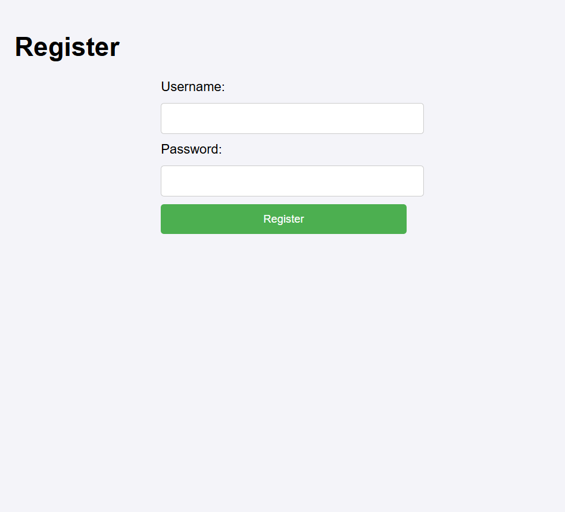
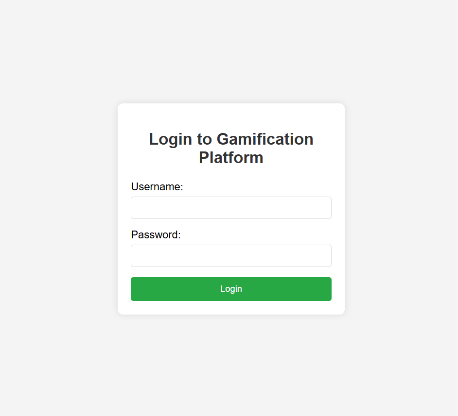
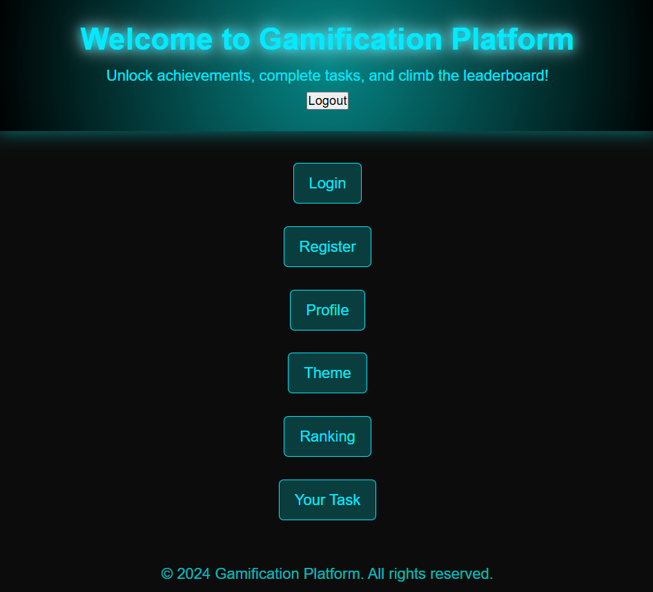
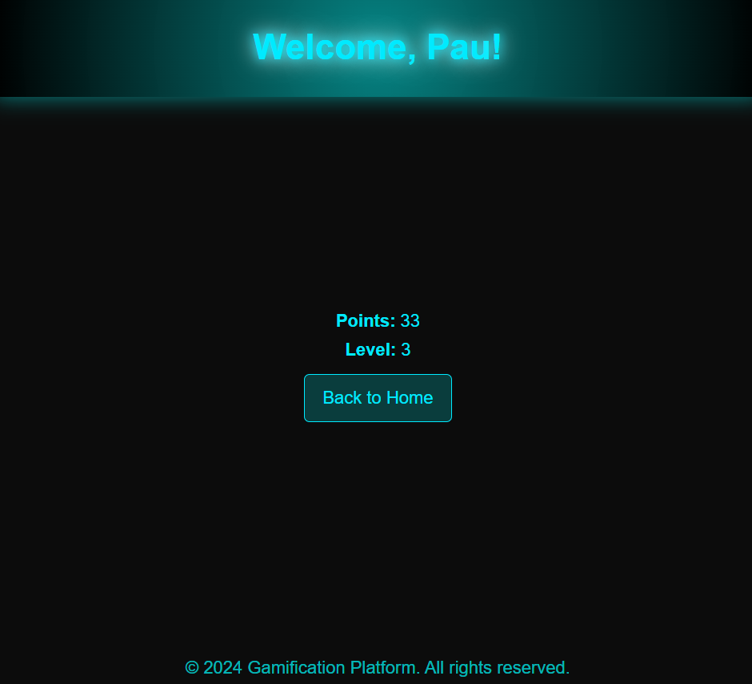
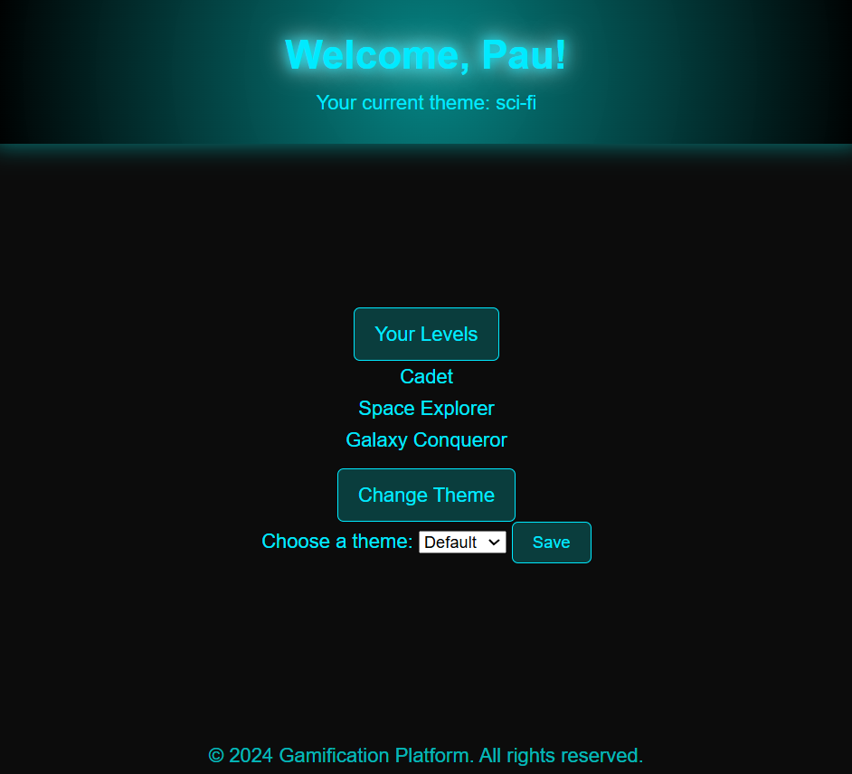
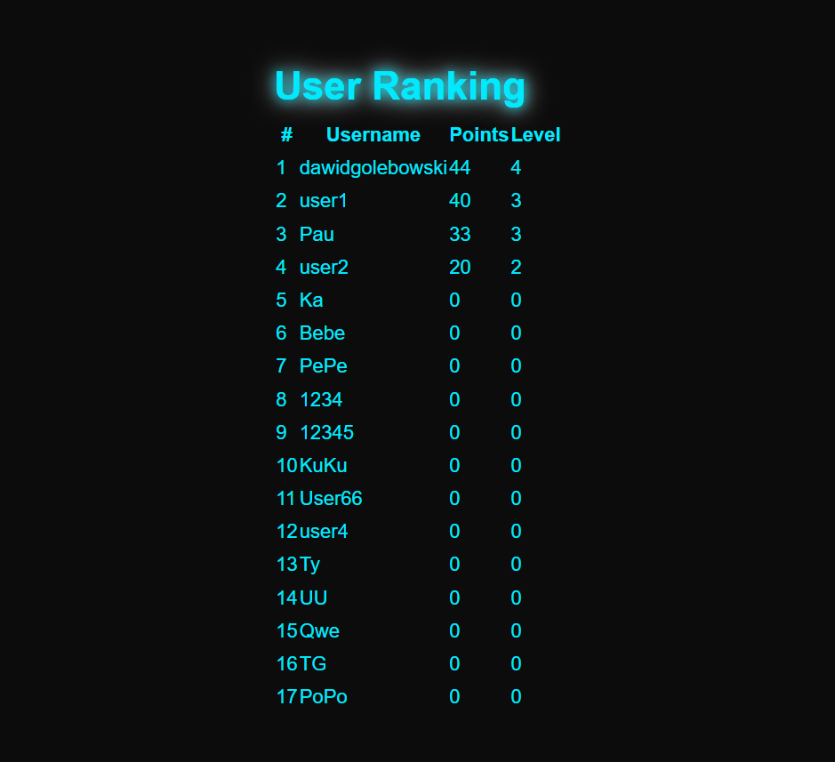
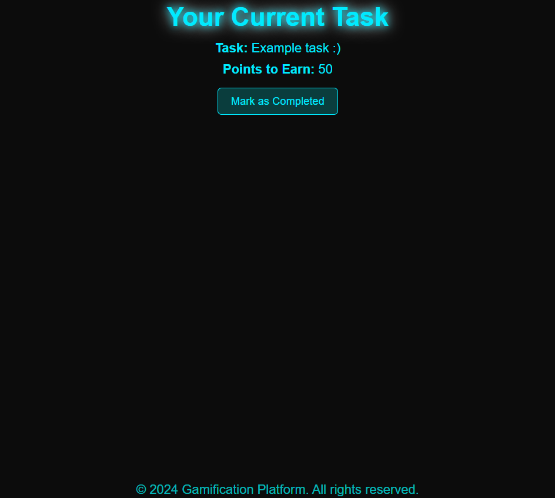

# Gamification App 🎮

A web application based on gamification mechanisms, created as an engineering thesis project.

The main goal of the project was to create a system that motivates users to complete real-life tasks by using game-like elements such as points, levels, themes, and user rankings.

The application combines productivity features with entertainment elements to encourage users to achieve goals and compete with others.

---

## 📌 Project Overview

The application allows users to:

- create an account and log in,
- manage their profile,
- complete assigned tasks,
- earn points and reach higher levels,
- customize the application theme,
- compare results with other users through a ranking system.

The system was designed using the MVC architectural pattern and uses Spring Boot as the backend framework with PostgreSQL as the database.

---

## 🚀 Features

### User Account Management
- User registration
- User authentication and login
- Secure password storage using BCrypt
- User profile with statistics

### Gamification System
- Task management
- Points system
- Level progression
- User ranking based on level and points

### Personalization
- Selection of application themes
- Different level names depending on the selected theme
- Dynamic user experience customization

---

## 🛠 Technologies

### Backend
- Java
- Spring Boot
- Spring Security
- Hibernate / JPA

### Database
- PostgreSQL

### Frontend
- Thymeleaf
- HTML
- CSS

### Tools
- IntelliJ IDEA
- Maven
- Git

---

## ⚙️ Configuration

The `application.properties` file is not included in the repository because it contains local database configuration.

Create your own configuration file based on `application-example.properties` and provide your PostgreSQL username and password.

---

## 🏗 Application Architecture

The application is based on the MVC (Model-View-Controller) architecture.

Controller | ↓ Service | ↓ Repository | ↓ Database

### Main Entities

#### User
Stores user information:
- username
- encrypted password
- points
- level
- selected theme

#### Task
Represents tasks assigned to users:
- task name
- reward points
- completion status

#### Level
Stores level information:
- theme
- level number
- level name

---

## 📷 Application Screenshots

### Registration

### Login

### Home Page

### User Profile

### Theme Selection

### Ranking

### Tasks

---

## 🧪 Testing

The application includes tests verifying selected system functionalities.

Implemented tests:

- Login functionality test
- Theme selection and level assignment test

Tests were created using Spring Boot testing tools.

---

## 🔒 Security

The application uses:

- **Spring Security** for authentication and access control,
- **BCryptPasswordEncoder** for secure password hashing,
- protected user data storage.

Passwords are never stored as plain text.

---

## 🔮 Future Improvements

Possible extensions of the project:

- achievement system,
- additional task categories,
- notifications,
- social features,
- mobile application version,
- more advanced gamification mechanics.

---

## 👨‍💻 Author

Engineering thesis project.

Technologies:
**Java | Spring Boot | PostgreSQL | Thymeleaf**
